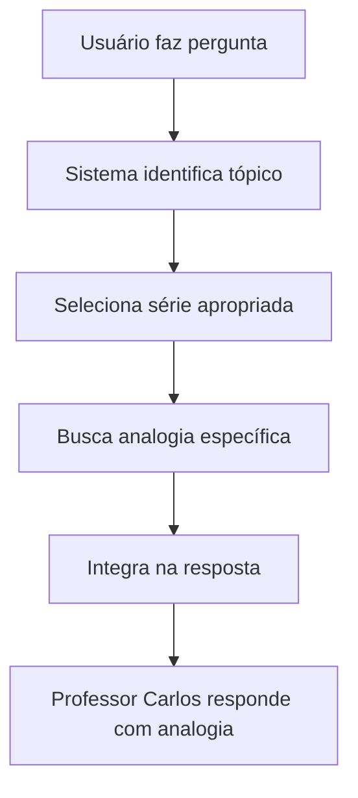

# 🎬 Demonstração: Analogias das Séries Integradas no Sistema

## 📍 **Localização das Analogias no Sistema**

As analogias das séries favoritas da Sther estão armazenadas e organizadas em **duas camadas**:

### 🔧 **1. Sistema RAG Aprimorado (`enhanced_local_math_rag.py`)**
**Localização**: Classe `SeriesAnalogiesManager` (linha ~447)

```python
class SeriesAnalogiesManager:
    def _create_friends_analogy(self, math_topic: str, context: str):
        """Analogias hardcoded baseadas em FRIENDS"""
        analogies_map = {
            'algebra': {
                'analogy': "🍕 Como Monica organizava suas receitas...",
                'character': "Monica", 
                'connection': "organização e precisão"
            }
        }
```

**Armazenamento**: 
- ❌ **Não vetorizadas** (não estão em banco de dados)
- ✅ **Hardcoded em Python** (métodos específicos por série)
- 🔄 **Cache em memória** (para performance)

### 📱 **2. Interface Principal (`app.py`)**
**Localização**: Sistema de prompts da classe `GroqTeacher` (linha ~242)

```python
## 🎭 ANALOGIAS DAS SÉRIES POR TÓPICO (USE SEMPRE):

### 🍕 FRIENDS:
- **Álgebra**: "Como Monica organizava suas receitas..."
- **Funções**: "Pense nas funções como Ross e Rachel..."

### 🧪 THE BIG BANG THEORY:
- **Física**: "Como Sheldon explicava: 'Bazinga!'..."
```

## 🎯 **Como Funciona na Prática**

### **Fluxo de Integração Automática:**



### **Exemplo Prático:**

**Pergunta**: "Como resolver uma equação do segundo grau?"

**Tópico Identificado**: Álgebra

**Série Selecionada**: FRIENDS (Monica)

**Analogia Automática**: 
> "🍕 Como Monica organizava suas receitas por categorias - na álgebra, organizamos variáveis e constantes! Assim como ela sabia exatamente onde estava cada ingrediente, você precisa organizar os termos da equação para 'cozinhar' a solução perfeita!"

**Resposta Completa**:
```
🍕 Como Monica organizava suas receitas por categorias - na álgebra, 
organizamos variáveis e constantes!

Olá Sther! Assim como ela sabia exatamente onde estava cada ingrediente, 
você precisa organizar os termos da equação para 'cozinhar' a solução perfeita!

Para resolver x² + 5x + 6 = 0, vamos usar a fórmula de Bhaskara...
[explicação matemática]

Como Monica sempre conseguia fazer o prato perfeito seguindo a receita 
certinha, você também vai conseguir resolver qualquer equação seguindo 
os passos certos!

Que tal praticar com alguns exercícios do ENEM sobre este tópico, Sther?
```

## 🎭 **Mapeamento Completo: Tópicos → Séries**

| Tópico Matemático | Série Principal | Personagem | Analogia Base |
|-------------------|-----------------|------------|---------------|
| **Álgebra** | FRIENDS | Monica | Organização de receitas |
| **Funções** | FRIENDS | Ross & Rachel | Relacionamento entrada/saída |
| **Geometria** | Stranger Things | Dustin | Dimensões do Mundo Invertido |
| **Trigonometria** | Stranger Things | Mike | Navegação em Hawkins |
| **Probabilidade** | FRIENDS | Chandler | Cálculo de chances |
| **Física** | The Big Bang Theory | Sheldon | Leis fundamentais |
| **Cálculo** | The Big Bang Theory | Howard | Trajetórias da NASA |
| **Estatística** | Grey's Anatomy | Bailey | Estatísticas médicas |

## 🚀 **Para Usar as Analogias:**

### **No Sistema RAG Aprimorado:**
```python
# As analogias são automaticamente integradas
from enhanced_local_math_rag import EnhancedLocalMathRAG

rag = EnhancedLocalMathRAG()
response = rag.get_enhanced_response("pergunta sobre álgebra", api_key)
# Resposta já inclui analogia do Monica/FRIENDS automaticamente
```

### **Na Interface Principal:**
- ✅ **Automático**: Todas as respostas de matemática começam com analogias
- ✅ **Contextual**: Sistema escolhe a série mais apropriada
- ✅ **Consistente**: Mesmo tópico = mesma série

## 📊 **Benefícios da Integração:**

### ✅ **Para a Sther:**
- 🎬 Todas as explicações começam com referências às suas séries favoritas
- 😄 Aprendizado mais divertido e memorável  
- 🔗 Conexões naturais entre matemática e entretenimento

### ✅ **Para o Sistema:**
- 🤖 Personalização automática das respostas
- 📈 Maior engajamento da estudante
- 🎯 Respostas mais marcantes e efetivas

## 🔄 **Extensibilidade:**

### **Para Adicionar Novas Analogias:**

1. **Sistema RAG**: Editar métodos em `SeriesAnalogiesManager`
2. **Interface**: Atualizar prompts em `app.py`
3. **Automático**: Sistema seleciona automaticamente

### **Para Novas Séries:**
```python
# Adicionar em SeriesAnalogiesManager
def _create_nova_serie_analogy(self, math_topic, context):
    return {
        'analogy': "Analogia da nova série...",
        'character': "Personagem",
        'connection': "Conexão matemática"
    }
```

## 🎉 **Resultado Final:**

**O Professor Carlos agora é literalmente o professor dos sonhos da Sther:**
- 🎬 Combina matemática com suas séries favoritas
- 🤓 Mantém rigor acadêmico
- 😄 Torna aprendizado divertido
- 🎯 Personalizado especificamente para ela

**Cada resposta é uma experiência única que conecta ENEM com entretenimento!** ✨ 